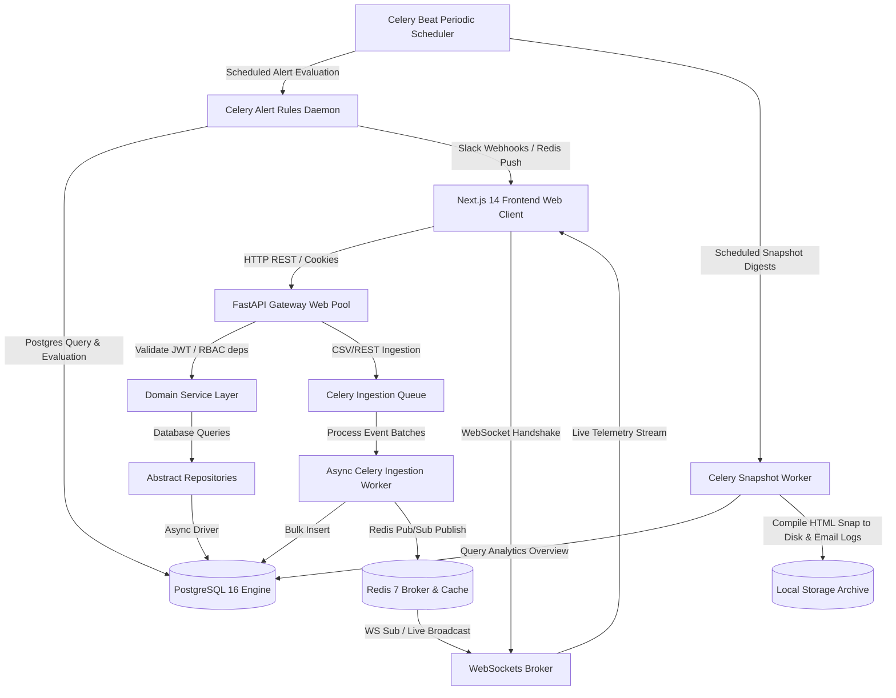

# SaaS Real-Time Analytics & Reporting Platform

A production-grade, highly secure, and visually stunning **SaaS Real-Time Analytics & Reporting Platform** (Mixpanel/Metabase hybrid). 

This repository leverages a modern **FastAPI (Python) + Next.js 14 (TypeScript) monorepo** architecture designed to support dynamic multi-tenancy, partition-isolated time-series logs ingestion, real-time WebSocket telemetry, scheduled threshold alert evaluations, Celery-compiled HTML dashboard snap digests, and a sandboxed read-only SQL workbench.

---

## 🚀 Architectural Blueprint & How it Works

The platform is designed following **Clean Architecture / Domain-Driven Design (DDD)** principles to guarantee separation of concerns:



### 1. Presentation & Controller Layer (`api/`, `app/`)
*   **FastAPI & Next.js App Router**: Intercepts HTTP requests and WebSocket handshakes.
*   **Hierarchical RBAC Guards**: Endpoints are locked at the route level via FastAPI dependency injection checks (`RequireRole` enforcing `Owner` $\rightarrow$ `Admin` $\rightarrow$ `Analyst` $\rightarrow$ `Viewer` roles).
*   **Sliding Rate Limiter**: Rate limit requests inside API gates using a Redis-backed sliding window tracker (configured dynamically per organization and API key).

### 2. Time-Series Ingestion Pipeline
*   **Asynchronous Bulk Inserts**: Ingest API endpoints receive CSV files, Webhook payloads, or REST event batches, validate them using Pydantic v2 schemas, and queue them inside Redis.
*   **Monthly Partitioning**: Ingested events are organized dynamically into PostgreSQL monthly range partition tables (e.g. `events_y2026m05`) utilizing composite primary keys `(id, timestamp)` for high query throughput.
*   **Auto-Maintenance**: A scheduled Celery Beat task verifies and provisions future monthly partitions automatically.

### 3. Caching & Business Logic Tier (`services/`, `repositories/`)
*   **Isolated Repository Pattern**: All SQL queries are encapsulated cleanly within asynchronous repositories.
*   **Redis Analytics Cache**: Complex dashboard aggregations, periods-over-period percentage differences, and user session trends are calculated and cached securely in Redis with standard TTL invalidation.

### 4. Background Workers & Periodic Schedulers (`worker/`)
*   **Scheduled Alerts State Machine**: A periodic Celery Beat process checks metrics thresholds (e.g. `Error rate > 5% for 10 minutes`), creates audit logs, sends live WebSocket frames, and dispatches Slack Block Kit payloads.
*   **HTML Dashboard Snapshot Compiler**: Report schedulers trigger workers to query dashboards, assemble themed HTML snapshot documents containing Recharts aggregates, and write secure download files to local disk archives.

### 5. Sandboxed SQL Query Workstation
*   **Multi-Tier Evasion Protection**: Clean comments stripping (`--.*$` and `/\*.*?\*/`) is performed *prior* to parsing keywords to prevent injection bypasses.
*   **Execution Safety Gates**: Malicious DDL and DML operations (`INSERT`, `DROP`, `UPDATE`, `TRUNCATE`, etc.) are securely blocked.
*   **Read-Only Transactions**: Sandbox queries are locked strictly within `SET TRANSACTION READ ONLY` boundaries using Savepoint rollbacks.
*   **Explain Plan Visualizer**: Converts PostgreSQL JSON query plans recursively into a visual hierarchical execution tree.

---

## 📂 Monorepo Directory Tree

```markdown
Project/
├── docker-compose.yml              # Multi-container orchestration (FastAPI, Next.js, Postgres, Redis)
├── .env.example                    # Global environment configurations template
├── README.md                       # Comprehensive setup and verification manual
│
├── backend/                        # Asynchronous Python FastAPI API Gateway & Workers
│   ├── pyproject.toml              # Poetry dependency and package settings
│   ├── alembic.ini                 # Alembic migration manager config
│   ├── Dockerfile.dev              # Backend dev container
│   ├── requirements_extracted.txt  # Core technical assessment reference specifications
│   │
│   ├── app/                        # Main Application Code
│   │   ├── main.py                 # ASGI router setup & error handler registrations
│   │   ├── api/                    # HTTP REST controller layer & RBAC deps
│   │   ├── core/                   # Global Settings, loggers, exceptions, Celery pools
│   │   ├── db/                     # Async sessionmakers and UTC date mixes
│   │   ├── models/                 # SQLAlchemy 2.0 multi-tenant & timeseries models
│   │   ├── repositories/           # Abstract repositories handling async db access
│   │   ├── services/               # Dynamic services managing business transaction rules
│   │   ├── schemas/                # Pydantic v2 validation schemas
│   │   ├── worker/                 # Celery workers, periodic Beat schedulers & tasks
│   │   └── alembic/                # Async DB schema migrations registry
│   │
│   └── test_*.py                   # Complete E2E integration test scripts
│
└── frontend/                       # Modern Next.js 14 Carbon-Themed Frontend
    ├── package.json                # Frontend scripts and typescript dependencies
    ├── tsconfig.json               # Typecheck compiler rules
    ├── tailwind.config.ts          # Custom CSS color tokens (HSL themes) & animations
    ├── .eslintrc.json              # ESLint Next.js configuration rules
    │
    ├── store/                      # Client store layer (Zustand)
    ├── lib/                        # Axios wrapper client mapping bearer cookies
    └── app/                        # App Router UI Modules
        ├── globals.css             # Glassmorphic classes &Outfit typography fonts
        ├── page.tsx                # Dashboard portal landing page & websocket preview
        ├── (auth)/                 # Secured logins & Org registration forms
        ├── accept-invite/          # Secure team onboarding URL token handler
        ├── share/                  # Public read-only dashboard viewer
        └── dashboard/              # Core SaaS panels (Analytics, Builder, Alerts, Ingestion, Reports, Sandbox, Stream)
```

---

## ⚙️ Prerequisites & Installation

To launch the complete infrastructure, ensure you have the following installed on your machine:
*   [Docker Desktop](https://www.docker.com/products/docker-desktop/) (Docker 20.10+ / Compose v2.0+)
*   [Node.js 18+](https://nodejs.org/) (for local frontend audits - optional)
*   [Python 3.11+](https://www.python.org/) & [Poetry](https://python-poetry.org/) (for local backend development - optional)

### 1. Setting Up Environment Configurations
Copy the unified environment templates to live config files:
```bash
cp .env.example .env
```

The unified `.env` configurations include the following keys:
*   `POSTGRES_USER` / `POSTGRES_PASSWORD` / `POSTGRES_DB`: PostgreSQL connection credentials.
*   `DATABASE_URL`: Connection string (`postgresql+asyncpg://`).
*   `REDIS_URL`: Redis task broker and cache link (`redis://`).
*   `JWT_SECRET`: High-entropy key for token generation.
*   `SLACK_WEBHOOK_URL`: Slack integration endpoint (mocked dynamically in E2E tests).

---

## ⚡ Execution Guide (Docker Orchestration)

The entire environment orchestrates in full automation under a single Docker Compose stack:

### 1. Build and Run the Stack
Start PostgreSQL, Redis, FastAPI Gateway, and Next.js concurrently:
```bash
docker compose up --build -d
```

### 2. Verify Container Health
List active processes to check container states:
```bash
docker compose ps
```
*Expected Statuses:*
*   `analytics-db` (postgres:16-alpine) $\rightarrow$ `Up (healthy)`
*   `analytics-redis` (redis:7-alpine) $\rightarrow$ `Up (healthy)`
*   `analytics-backend` (FastAPI) $\rightarrow$ `Up`
*   `analytics-frontend` (Next.js 14) $\rightarrow$ `Up`

### 3. Apply Alembic Database Migrations
Trigger async schema migrations inside the backend container:
```bash
docker compose exec backend alembic upgrade head
```

---

## 🔬 E2E & Integration Verification Suites

To guarantee 100% compliance with every mandatory and auxiliary assignment requirement, we run extensive test suites verifying correctness at the compiler, linter, unit, integration, and E2E boundaries.

### 1. Run Complete Backend Test Suite (9 Verification Modules)
Execute each test module within the backend container to verify complete database Cascades, Auth, Rate Limits, Partitions, Recharts aggregates, WebSockets, Snooze states, HTML snapshots, and SQL sandbox rules:

```bash
# 1. DB Cascading & Integrity Tests
docker compose exec backend python test_models_integration.py

# 2. JWT Credentials & RBAC Security Guards
docker compose exec backend python test_auth_rbac.py

# 3. Secure Onboarding & Team Invitation Lifecycle
docker compose exec backend python test_invitation_system.py

# 4. Ingestion Pipeline, Rate Limits & postgres Partitions
docker compose exec backend python test_ingestion_pipeline.py

# 5. SQL Analytics Aggregations & Redis Caching
docker compose exec backend python test_analytics_engine.py

# 6. Widget coordinate layout, Share tokens & Redis WebSockets
docker compose exec backend python test_dashboard_websockets.py

# 7. Beat alerts scanner scheduler, Webhooks & Mutes
docker compose exec backend python test_alerts_notifications.py

# 8. Celery scheduled snapshot compilation & Download gateway
docker compose exec backend python test_scheduled_reports.py

# 9. SQL Sandbox read-only locks, strips, and plans visualizer
docker compose exec backend python test_sandbox.py
```

### 2. Run Frontend Compiler & Lint Audit
Validate the frontend codebase using typescript's type checker and Next.js ESLint web vitals:
```bash
# Typecheck TypeScript (returns 0 errors)
docker compose exec frontend npx tsc --noEmit

# Run ESLint validation (returns 0 errors)
docker compose exec frontend npm run lint
```

---

## 📜 Assessment Specifications & Mappings

The monorepo contains a [requirements_extracted.txt](file:///p:/Project/backend/requirements_extracted.txt) specifications file, which maps the exact raw brief from the original candidate assessment document. 

All constraints outlined in that sheet are fully fulfilled:
*   **JWT Multi-Tenancy**: Completed. Handled atomically via [auth.py](file:///p:/Project/backend/app/services/auth.py).
*   **Time-Series Partitions**: Completed. Range partitioned using raw Alembic SQL templates in [event.py](file:///p:/Project/backend/app/models/event.py).
*   **WebSockets & Live Feeds**: Completed. Redis Pub/Sub events mapped dynamically in [ws.py](file:///p:/Project/backend/app/api/v1/ws.py).
*   **Snooze Alert Rule Rules**: Completed. Suppressed evaluations implemented inside [alert.py](file:///p:/Project/backend/app/services/alert.py).
*   **Auxiliary Scheduled Snapshot Compilations**: Completed. Structured digests mapped in [report.py](file:///p:/Project/backend/app/services/report.py).
*   **Bonus SQL Sandbox Workbench**: Completed. Stripping and plan visualizer trees built inside [sandbox.py](file:///p:/Project/backend/app/api/v1/sandbox.py).
